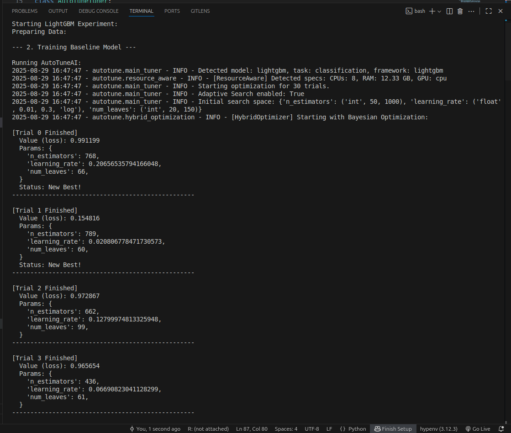
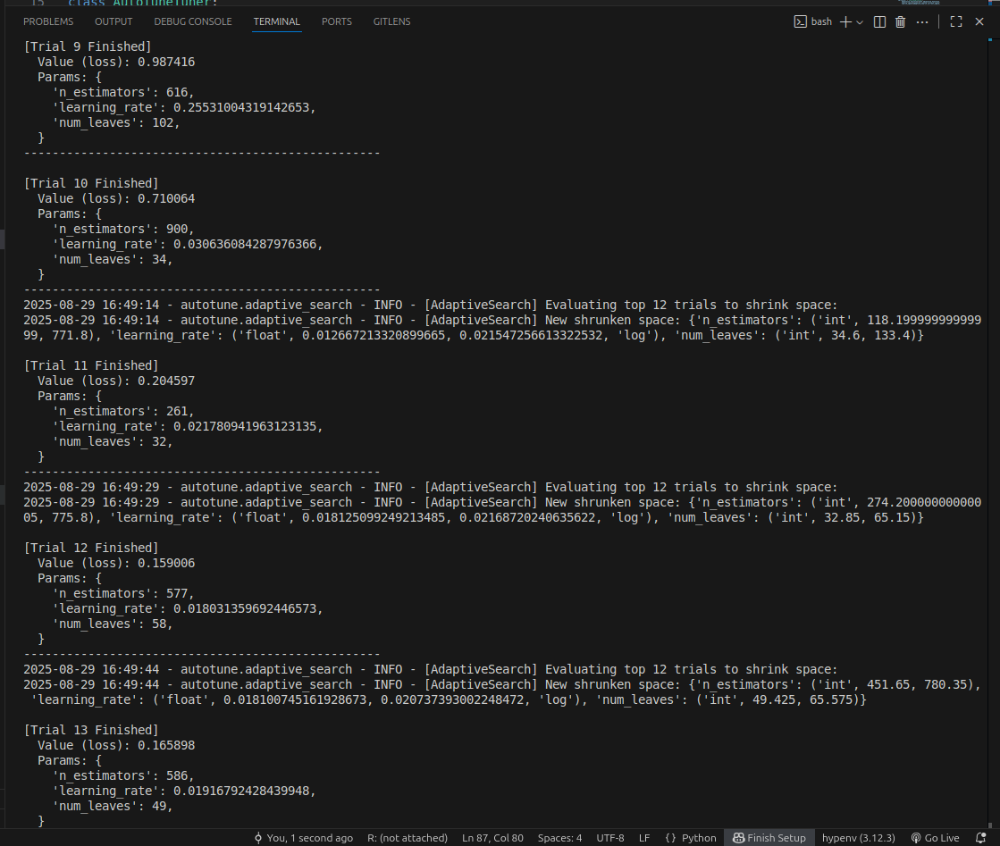
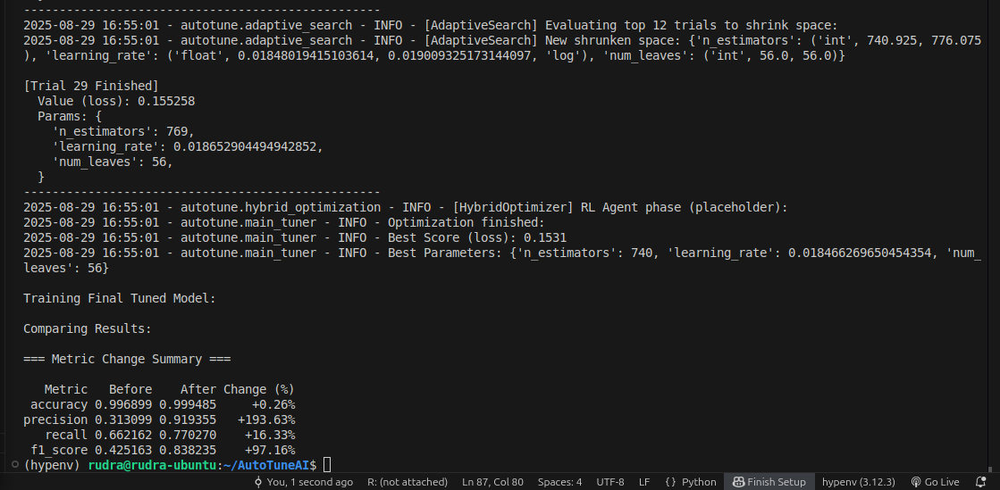

# AutoTuneAI: An Intelligent, Adaptive Hyperparameter Optimization System


## Abstract
Hyperparameter Optimization (HPO) is a critical stage in the machine learning lifecycle, yet it remains a significant challenge due to the high dimensionality of search spaces and the computational cost of model evaluation. Standard optimization algorithms like Bayesian Optimization are powerful but operate with limited context. This project, AutoTuneAI, presents a research-focused toolkit that constructs an intelligent meta-learning layer on top of a core optimizer. It introduces a suite of context-aware heuristics—including hardware-resource awareness, model- and task-awareness, and a novel "Elite Group" adaptive search strategy—to automate and accelerate the discovery of optimal parameters. When benchmarked on a highly imbalanced fraud detection dataset, AutoTuneAI successfully tuned a LightGBM model, improving the F1-score by over 97% and precision by over 190% compared to the baseline, demonstrating the significant value of a holistic, system-aware approach to HPO.

---

## Key Features
* **Multi-Strategy Intelligence:** Combines multiple heuristics to make smarter decisions than a standalone optimizer.
* **Resource-Aware Tuning:** Actively inspects system hardware (CPU/RAM) to constrain the search space, preventing crashes and improving efficiency on low-spec machines.
* **Task-Aware & Auto-Detect:** Automatically identifies the model architecture and task type (e.g., `LightGBM`, `CNN`, `NLP`) to initialize the search from a curated, high-potential region of the hyperparameter space.
* **"Elite Group" Adaptive Search:** A custom-designed dynamic search strategy that intelligently "zooms in" on the most promising hyperparameter regions during a run, filtering for truly elite candidates to accelerate convergence and avoid "local optimum" traps.
* **Modular & Extensible:** Built with a clean separation of concerns, featuring a professional Command-Line Interface (CLI) for running experiments and a modular structure that allows for easy integration of new models and tuning strategies.

---

## Project Architecture
The system is designed with a clear separation of concerns, reflecting professional MLOps practices.

`CLI (main.py)` -> `Experiment Scripts (examples/)` -> `Core Library (autotune/)`

1.  **The CLI (`main.py`):** A user-friendly control panel built with Typer for launching experiments with different models and parameters.
2.  **Experiment Scripts (`examples/`):** Self-contained, reusable "recipes" that define the baseline model, the objective function, and the evaluation logic for a specific task.
3.  **The Core Library (`autotune/`):** The heart of the project. A fully packaged and installable library containing all the intelligent modules (`ResourceAwareTuner`, `AdaptiveSearchSpace`, etc.).

---

## Installation & Setup

1.  **Clone the repository:**
    ```bash
    git clone https://github.com/Rudra-K/AutoTuneAI
    cd AutoTuneAI
    ```
2.  **Create and activate a virtual environment:**
    ```bash
    python3 -m venv venv
    source venv/bin/activate
    ```
3.  **Install dependencies:**
    ```bash
    pip install -r requirements.txt
    ```
4.  **Install the library in editable mode:**
    ```bash
    pip install -e .
    ```

---

## Usage
Use the `main.py` CLI to run experiments.

* **To see all available commands and options:**
    ```bash
    python main.py --help
    ```
* **To run the LightGBM showcase experiment:**
    ```bash
    python main.py tune-lgbm --n-trials 50 --no-adaptive
    ```
    **OR**
    ```bash
    python main.py tune-lgbm --n-trials 50 --adaptive
    ```

---

## Methodology: The AutoTuneAI Intelligence Layers

AutoTuneAI's power comes from composing several intelligent heuristics.

### 1. Task-Aware Search Space Initialization
The process begins by using `auto_detect.py` to identify the model and task. This information is used to select a highly-relevant initial search space from a hierarchical configuration file (`search_space_config.py`). This avoids wasting time on irrelevant hyperparameters and starts the search in a region known to be effective for that specific context (e.g., using `AdamW` and a low learning rate for Transformers).

### 2. Resource-Aware Space Constraining
Before tuning begins, `resource_aware.py` inspects the host machine's hardware. If it detects a low-spec environment (e.g., < 4 CPU cores or < 8 GB RAM), it applies a "safety shrink" to the numerical ranges in the search space. This prevents the optimizer from choosing parameters that would overwhelm the machine, making the tool robust and usable even on standard laptops.

### 3. "Elite Group" Adaptive Search
This is a custom-designed dynamic strategy implemented in `adaptive_search.py`.
* **Problem:** Standard Bayesian search can be slow to converge, and naive adaptive strategies can get "trapped" by focusing on a cluster of mediocre results.
* **Solution:** After an initial exploration phase (a dynamic percentage of `n_trials`), the system identifies the `top_k` trials. It then applies an `elite_fraction` filter to select only the absolute best performers from that group. The search space is then mathematically re-centered and shrunk around this "elite" region. This provides a more robust signal, avoids the "adaptive trap," and accelerates convergence to a high-quality optimum.

---

## Showcase: LightGBM for Fraud Detection

To demonstrate its effectiveness, AutoTuneAI was tasked with tuning a LightGBM classifier on a highly imbalanced credit card fraud dataset (~285k rows).

* **Model:** `LightGBM`, a powerful and hyperparameter-sensitive gradient boosting model.
* **Metric:** The objective was set to `average_precision`, a robust metric that rewards models for finding a good balance between Precision and Recall—critical for a practical fraud detection system.
* **Result:** The experiment compared a default LightGBM model against the model found by AutoTuneAI after 30 trials. The results were a massive success.


 



| Metric    | Before   | After    | Change (%)  |
| :-------- | :------- | :------- | :---------- |
| accuracy  | 0.996899 | 0.999485 | +0.26%      |
| precision | 0.313099 | 0.919355 | **+193.63%**|
| recall    | 0.662162 | 0.770270 | **+16.33%** |
| f1_score  | 0.425163 | 0.838235 | **+96.16%** |

The tuner successfully created a model that is both highly precise (very few false alarms) and has strong recall (catches most fraud cases).

## Future Work
The modular architecture of AutoTuneAI serves as a foundation for further research.
* **Hybrid Bayesian-Evolutionary Optimizer:** The next major feature is to implement a Genetic Algorithm (GA). The Bayesian optimizer will act as a global "scout" to find promising regions, and the GA will then be deployed as a "special ops team" to intensively search those regions using crossover and mutation, creating a powerful two-stage search process.

## License
This project is licensed under the MIT License.
